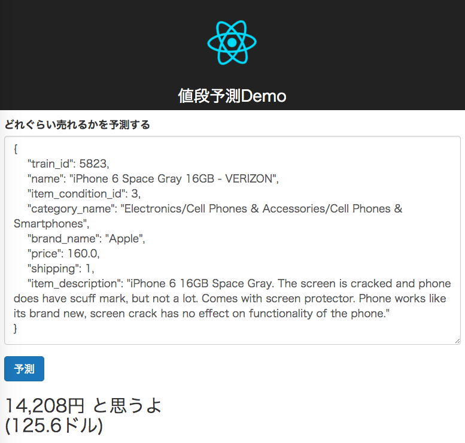
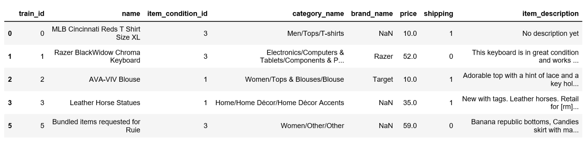
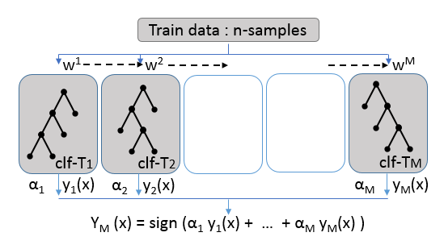
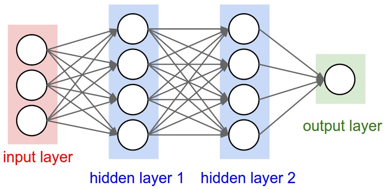

# 値段を予測するAIを作ってみた

## 背景

メリカリが値段をAIでサジェストしてくれる記事を見た。

実際Kaggle上にデータと参考のソースコードがあるため、自分でも作ってみた。

こんな感じ



デモ

平均の誤差(RMSLE)は0.69で、1400位くらい。
平均の値段の誤差は16ドルくらい。


1位は0.37。


[github ソース](https://stainless.dreamarts.co.jp/l-zhang/price-recommend)

### Usage

```
$ python3 web.py

$ open http://localhost:5000

```


## 実現の仕方

### データを見る




### データを加工する

* 名前・カテゴリ・説明をVector化 (tf/idf)

```
"MLB Cincinati Reds T Shirt Size XL"
↓
[0.1, 0.12, 4.2, 6.1, 1.5, 3.5, 4.8]
```

* ブランド・コンディション・送料オプションをOne-hot Vector化

```
"Apple", "Sony", "Samsung", "Missing"
↓
[1,0,0,0], [0,1,0,0], [0,0,1,0], [0,0,0,1]
```

### 違うフィーチャーをつなぐ
[0, 0, 0, 1, 0.1, 0.12, 4.2, 6.1, 1.5, 3.5, 4.8]


### モデル

* 勾配ブースティング木(Gradient Boosting Decision Tree)
  * マイクロソフトのLightGBMライブラリを使用
  


#### 勾配ブースティング木の強み
* 表形式データにに向いている
* モデルは簡単
* 訓練・推測は早い
* 推測ロジックは説明しやすい

#### ニューラルネットワークの強み



* 画像・音声・ビデオ・自然言語処理（認識・生成）
* モデルはたくさんのバリエーションがある
* 大量データの時より精度向上

## 今後の発展

* いろんなフォームデータから、結果を推測・分類するタスクに活用できそう
  * 与信判断？ プロジェクト健康度判断？ 
* Word2VecでテキストのVectorを強化
* CNN/RNNで精度向上？


## 参考

[1] <https://towardsdatascience.com/machine-learning-for-retail-price-suggestion-with-python-64531e64186d>

[2] <https://www.kaggle.com/c/mercari-price-suggestion-challenge>

[3] <https://qiita.com/TomokIshii/items/3729c1b9c658cc48b5cb>

[4] <https://homes.cs.washington.edu/~tqchen/pdf/BoostedTree.pdf>

[5] <https://www.quora.com/Why-is-xgboost-given-so-much-less-attention-than-deep-learning-despite-its-ubiquity-in-winning-Kaggle-solutions#>


